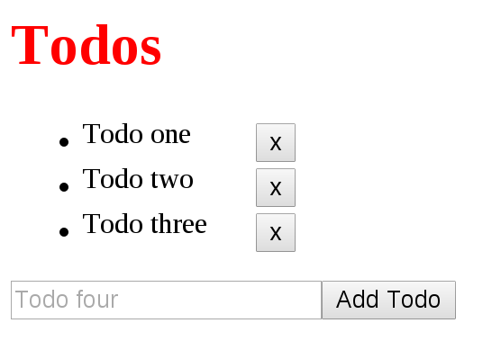
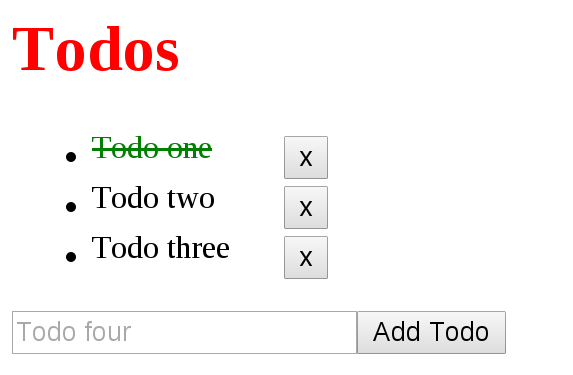
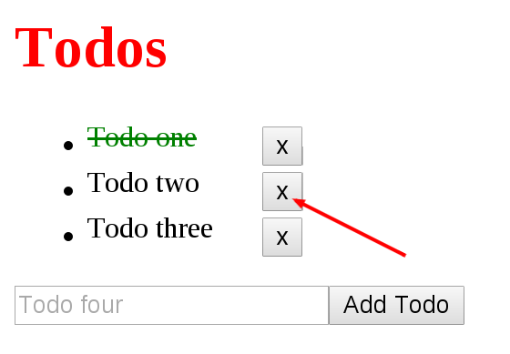
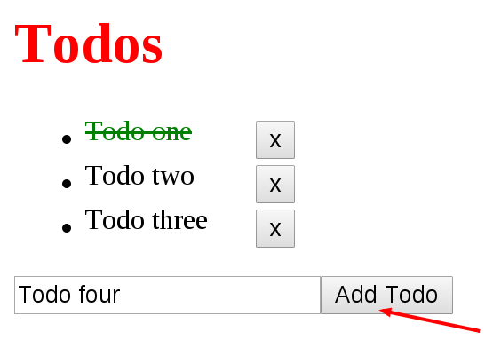

This repo shows you how to test React component. It is loosely based on Jack Franklin's article ["Testing React Applications"](http://12devsofxmas.co.uk/2015/12/day-2-testing-react-applications/).


## Introduction

We use two testing approaches.

- [React official Test Utilities](https://facebook.github.io/react/docs/test-utils.html)
- [Airbnb's Enzyme Library](https://github.com/airbnb/enzyme)

Each approaches have two ways to do the testing.

- **Shallow Rendering**: render the component into a React Object instance
- **DOM Rendering**: render the component into a real DOM node

We will cover all of these stuffs.

## Demo

We use a Todo app as the demo. You should install it.

```bash
$ git clone https://github.com/ruanyf/react-testing-demo.git
$ cd react-testing-demo && npm install
$ npm start
```

Now, you visit http://127.0.0.1:8080/, and see a Todo app.



It contains two components: `<TodoList/>` and `<AddTodo/>`.

```html
// app/components/App.jsx
<div>
  <h1>Todos</h1>
  <TodoList/>
  <AddTodo/>
</div>
```

Click the Todo item. A line strikes through it. Click again, the line disappear.



Click the Delete button. The Todo item is deleted.



Click the Add Todo button. A new Todo item is added.



## What to test

There are five test cases of the Todo app.

1. Expect App's title equals "Todos"
1. After initial loading, expect no 'todo-done' class in Todo item's classList
1. Click the Todo item, expect the Todo item shoule be striked through
1. Click the delete button, expect the Todo item should be deleted
1. Click the add Todo button, expect a new Todo item shoule be added into the TodoList

Now run the test, and see the result.

```bash
$ npm test
```

## Licence

MIT
